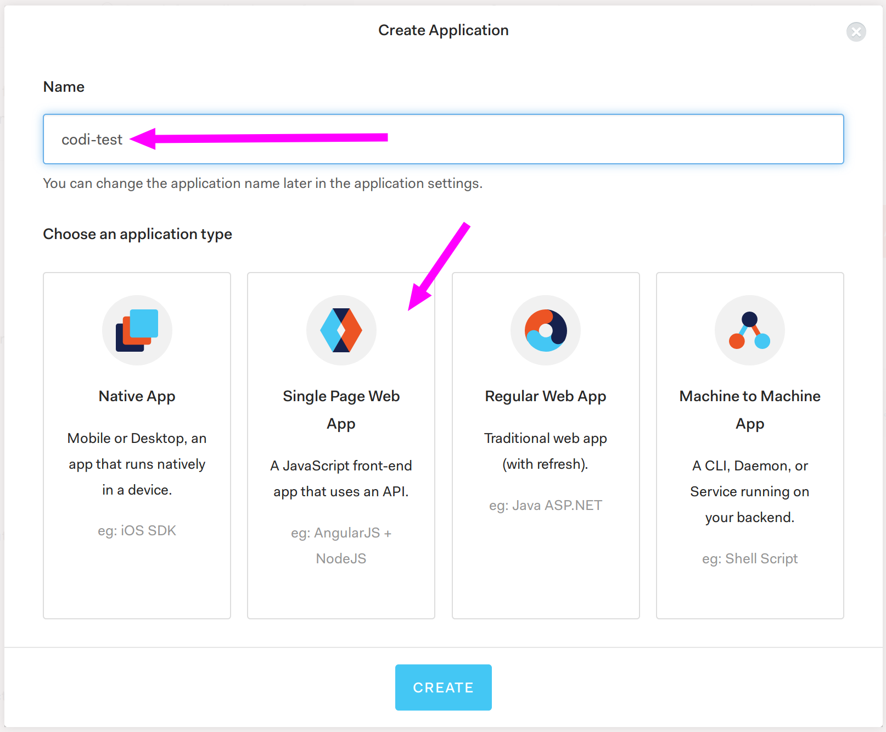
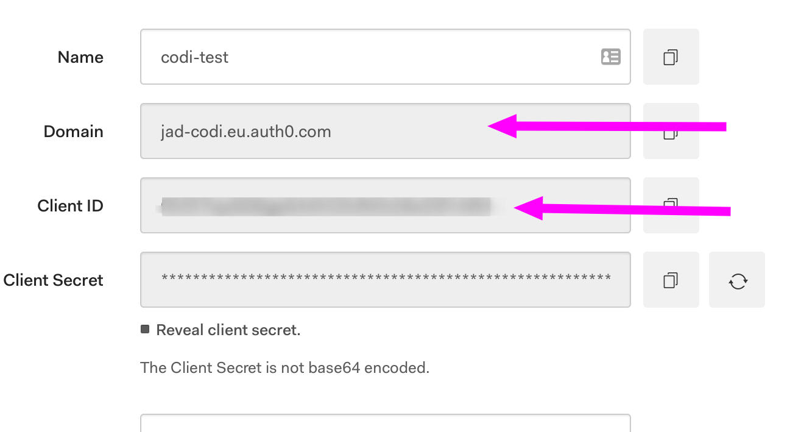

# Production Grade Authentication

As we discussed in the [previous chapter](../05-auth/readme.md), we are not going to handle actual authentication ourselves.

We'll delegate this to a 3rd party called [Auth0](https://auth0.com/). They have a free tier which allows 7000 users and two login providers. It will be enough for our needs. Another very good option is [Firebase](https://firebase.google.com)

There is a very good, and complete tutorial [on the official website](https://auth0.com/blog/react-tutorial-building-and-securing-your-first-app/); we'll be adapting it to work for our case.1

## Signing up to Auth0

First thing you'll do is [sign up](https://auth0.com/signup) for a free account. This gives you access to:


- [Passwordless authentication](https://auth0.com/passwordless)
- [Lock for Web, iOS & Android](https://auth0.com/docs/libraries/lock/v11)
- [Up to 2 social identity providers (like Twitter and Facebook)](https://auth0.com/learn/social-login/)
- [Unlimited Serverless Rules](https://auth0.com/docs/rules/current)
- [Community Support](https://community.auth0.com/)

After signing up, you will have to create [an Auth0 Application](https://manage.auth0.com/#/applications) to represent your app. So, in your dashboard, click on the Applications section on the vertical menu and then click on *Create Application*.

Choose a name for your application, select "Single Page Web App", and press *create*.



Heading to the *Settings* tab, search for the Allowed Callback URLs field and insert `http://localhost:3000/callback`.

With this value in place, you can click on the Save Changes button and leave this page open.

## Setting up Express


First, we'll add [helmet](https://github.com/helmetjs/helmet), a library that helps secure express servers.
(Later on, we'll use a different [helmet](https://www.npmjs.com/package/react-helmet) library, don't mistake them!)

We'll also add:

- [express-jwt](https://github.com/auth0/express-jwt): A middleware that validates a JSON Web Token (JWT) and set the req.user with its attributes.
- [jwks-rsa](jwks-rsa): A library to retrieve RSA public keys from a JWKS (JSON Web Key Set) endpoint.

Move the `back` and run :
```sh
npm install --save helmet express-jwt jwks-rsa
```

```js
// back/src/app.js
...
import helmet from 'helmet'
...
app.use(helmet()) // make it the first thing your express app uses
```

Then open `auth.js`:

`Replace the previous content of auth.js with :`
```js
// back/src/auth.js
import jwt from 'express-jwt'
import jwksRsa from 'jwks-rsa'

const AUTH0_DOMAIN = ''
const AUTH0_CLIENT_ID = ''

export const isLoggedIn = jwt({
  secret: jwksRsa.expressJwtSecret({
    cache: true,
    rateLimit: true,
    jwksRequestsPerMinute: 5,
    jwksUri: `https://${AUTH0_DOMAIN}/.well-known/jwks.json`
  }),

  // Validate the audience and the issuer.
  audience: AUTH0_CLIENT_ID,
  issuer: `https://${AUTH0_DOMAIN}/`,
  algorithms: ['RS256']
});
```

This constant is actually an Express middleware that will validate ID tokens. Note that, to make it work, you will have to fill the `<AUTH0_CLIENT_ID>` const with the value presented in the `Client ID` field of your Auth0 Application. Also, you will have to fill the `<AUTH0_DOMAIN>` const with the value presented in the `Domain` field (e.g. `bk-tmp.auth0.com`).



**note**: We will extract those values later so they're not present in the code that you put in a public repo. But for now, it's ok to write them directly in the code. Just *don't* put those values in a public repo.

**note**: The other methods in `auth.js` are not useful anymore. The logging in and logging out will happen directly between React and Auth0. Our server's job remains to simply check if the user is authenticated, nothing more.

## Setting up React

We're going to need a few things:

1. A piece of code to handle all the Auth0 stuff
2. A way for our app to know if the user is logged in or not
3. A way for the user to log in (the equivalent of our previous log in form)

First, move to the `front` and install auth0-js.

```sh
npm install --save auth0-js
```

Then let's create the piece of code. Create a new file, `auth.js` in `front/src`:

```js
// front/src/auth.js
import auth0 from "auth0-js";

const AUTH0_DOMAIN = ''
const AUTH0_CLIENT_ID = ''

let idToken = null;
let profile = null;
let expiresAt = null;

const auth0Client = new auth0.WebAuth({
  // the following three lines MUST be updated
  domain: AUTH0_DOMAIN,
  audience: `https://${AUTH0_DOMAIN}/userinfo`,
  clientID: AUTH0_CLIENT_ID,
  redirectUri: "http://localhost:3000/callback",
  responseType: "id_token",
  scope: "openid profile"
});

/**
 * This is the method that the app will call right after the user is redirected from Auth0.
 * This method simply reads the hash segment of the URL to fetch the user details and the id token.
 */
export const handleAuthentication = async () => {
  return new Promise((resolve, reject) => {
    auth0Client.parseHash((err, authResult) => {
      if (err){ return reject(err);}
      if(!authResult || !authResult.idToken){ return reject(new Error('user was not registered'))}
      idToken = authResult.idToken;
      profile = authResult.idTokenPayload;
      // set the time that the id token will expire at
      expiresAt = (authResult.expiresIn || 1000) * 1000 + new Date().getTime();
      console.log(authResult)
      resolve(profile);
    });
  });
}

/**
 * This method signs a user out by setting the profile, id_token, and expiresAt to null.
 */
export const signOut = ()  => {
  idToken = null;
  profile = null;
  expiresAt = null;
}

/**
 * This method returns the profile of the authenticated user, if any
 */
export const getProfile = () => profile;

/**
 * This method returns the `idToken` generated by Auth0 for the current user. 
 * This is what you will use while issuing requests to your POST endpoints.
 */
export const getIdToken = () => idToken;

/**
 * This method returns whether there is an authenticated user or not.
 */
export const isAuthenticated = () => new Date().getTime() < expiresAt;

/**
 * This method initializes the authentication process.
 * In other words, this method sends your users to the Auth0 login page.
 */
export const signIn = () => auth0Client.authorize();

```

Of course, similarly to the previous time, we'll have to fill `AUTH0_DOMAIN` and `AUTH0_CLIENT_ID`.

Now, let's use this instead of our custom authentication system.

First, import it in `App.js`:

```js
// front/src/App.js
import * as auth0Client from './auth';
```

then replace:

```js
...
  renderUser() {
    const { token } = this.state;
    if (token) {
      // user is logged in
      return this.renderUserLoggedIn();
    } else {
      return this.renderUserLoggedOut();
    }
  }
  renderUserLoggedOut(){
    ...
  }
  renderUserLoggedIn(){
    ...
  }
...
// with:
  renderUser() {
    const isLoggedIn = auth0Client.isAuthenticated()
    if (isLoggedIn) {
      // user is logged in
      return this.renderUserLoggedIn();
    } else {
      return this.renderUserLoggedOut();
    }
  }
  renderUserLoggedOut() {
    return (
      <button onClick={auth0Client.signIn}>Sign In</button>
    );
  }
  renderUserLoggedIn() {
    const nick = auth0Client.getProfile().name
    return <div>
      Hello, {nick}! <button onClick={auth0Client.signOut}>logout</button>
    </div>
  }
...
```

**note**: it's still useful to have those methods; for example, you might want to pop a toast saying "login successful". But we're trying to keep the amount of methods manageable, so for now, remove them.

You can also go ahead and remove the `onLoginSubmit`, `login`, and the `logout` methods, as well as the `nick` and `token` keys in `state`. `Auth0` is now handling this, we only have to display the results. Also, you can remove all references to `makeUrl({ token: this.state.token})`.

However, we will replace this with Auth0's `token`. Instead of sending it in `GET` parameters, Auth0 uses a specific header. Everywhere you need to authenticate, you can send:

```js
{ headers: { 'Authorization': `Bearer ${auth0Client.getIdToken()}` } }
```

For example, the `getPersonalPageData` url fetching becomes:

```js
// front/src/App.js
...
  const url = makeUrl(`mypage`);
  const response = await fetch(url,{ headers: { 'Authorization': `Bearer ${auth0Client.getIdToken()}` } });
...
```

This is no different than sending the token like we used to, it's just better to keep it in another part of the request so it doesn't show everywhere all the time.

Finally, let's add a new route, `/callback`, and a handler for it:

```js
... // this route inside renderContent() { ... }:
    <Route path="/callback" render={this.handleAuthentication} />
... // and this method just after renderContent() { ... }:
  isLogging = false;
  login = async () => {
    if (this.isLogging === true) {
      return;
    }
    this.isLogging = true;
    try{
      await auth0Client.handleAuthentication();
      const name = auth0Client.getProfile().name // get the data from Auth0
      await this.getPersonalPageData() // get the data from our server
      toast(`${name} is logged in`)
      this.props.history.push('/profile')
    }catch(err){
      this.isLogging = false
      toast.error(err.message);
    }
  }
  handleAuthentication = ({history}) => {
    this.login(history)
    return <p>wait...</p>
  }
```

**note**: if the app re-renders, it may call `login` repeatedly. So with the `isLogging` property, we ensure subsequent calls will be cancelled

And you should be ready to go!

We still have a little problem: the `logout` button doesn't seem to work. The reason is that, when the button is clicked, the user *is* logged out, but the state of the App doesn't change, thus, our view doesn't change.

Simple fix:

```js
// replace
Hello, {nick}! <button onClick={auth0Client.signOut}>logout</button>
// with
Hello, {nick}! <button onClick={()=>{auth0Client.signOut();this.setState({})}}>logout</button>
```

We simply force the state to change by passing an empty object. It's hacky, but does the trick (there are cleaner methods of doing that, but this will suffice for now).

### Final Cleanup 
Congradulation, we have implemented Auth0 a third party user authentification.
If you haven't done it before remove the old methods in `back/src/auth.js`. 

You also have to remove previous route in `back/src/index.js`.

> `app.get('/login', authenticateUser)` 

And 

> `app.get('/logout', logout)` 

Don't forget to cleanup the import to avoid warnings

> `import { authenticateUser, logout, isLoggedIn } from './auth'`

Become

>  `import { isLoggedIn } from './auth'`

Almost there!

`One problem`, your application forgets the user as soon as the browser is refreshed. Let's fix that in [PART 2](./02-persistent-login.md).
===

**Note** if you get an `EADDRINUSE` error when your server restarts, edit the `start` script in your `back/package.json`, and change it to:

```js
...
  "scripts": {
    "start": "nodemon --signal SIGINT --exec babel-node ./src/index.js",
...
```

### Side Note

The `user` object returned by Auth0 looks like this:

```js
// from a google login
{
  nickname: 'jad',
  given_name: 'Jad',
  family_name: 'Sarout',
  name: 'Jad Sarout',
  picture: 'https://lh3.googleusercontent.com/-D6xEy6QxumI/AAAAAAAAAAI/AAAAAAAAAAA/AGDgw-hmSH3-QZbeMsNpJrQo__bk3axf6A/mo/photo.jpg',
  locale: 'en',
  updated_at: '2018-11-28T07:39:46.821Z',
  iss: 'https://jad-codi.eu.auth0.com/',
  sub: 'google-oauth2|104600149175848010526',
  aud: '052ETrqx0GNgeS44X1DUNOz16a33FLMM',
  iat: 1543390786,
  exp: 1543426786,
  nonce: 'k4871KwpQ9e1nHe~61_riENlfZjvxX_o'
}
// from an email + pass registration
{
  nickname: "jad",
  name: "jad@codi.tech",
  picture: "https://s.gravatar.com/avatar/db7d311138fffc4c3c2fc71e1b6027ac?s=480&r=pg&d=https%3A%2F%2Fcdn.auth0.com%2Favatars%2Fja.png",
  updated_at: "2018-11-28T11:37:57.281Z"
  iss: "https://jad-codi.eu.auth0.com/",
  sub: "auth0|5bfe6e775da66525bbede529",
  aud: "052ETrqx0GNgeS44X1DUNOz16a33FLMM",
  iat: 1543406778,
  exp: 1543442778,
  nonce: "z~KCPlEyIZFuNjQ7V0v4poYZ2ZbqD6MO",
}
```

We can count with relative certainty on the following three properties:

- `nickname`
- `name`
- `picture`