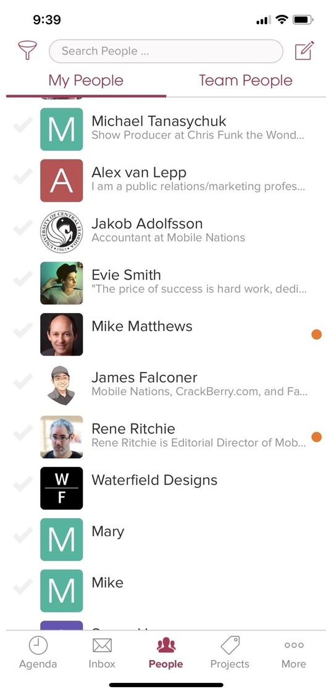

# Structure

We could be using any number of frameworks, but we wont. In order to understand css better, and also because it's not so hard, we'll build the style from scratch.

If you didn't want to do so from scratch, here's a selection of simple, yet elegant CSS frameworks you could choose to use. Each of the links below leads to a *pure css* framework, without any javascript usage. The ones that are tagged as `minimalistic` work with very few classes.

- Very simple frameworks
  - [Chota](https://jenil.github.io/chota/) (Grid, UI, minimalistic)
  - [Picnic](https://picnicss.com/)★★ (Grid, UI, minimalistic) 
  - [Tacit](https://yegor256.github.io/tacit/) (UI, minimalistic)
  - [Wing](https://kbrsh.github.io/wing/)★  (Grid, UI, minimalistic)
  - [Frow](https://frowcss.com/grid-system.html)★ (Grid, UI, Sass)
- Complete Frameworks
  - [Pure](https://purecss.io/)★ (Complete yet Simple)
  - [TurretCss](https://turretcss.com/)★ (Complete yet simple)
  - [Bulma](https://bulma.io) (Complete, Sass)★ 
  - [Fictoan](https://sujan-s.github.io/fictoan/)★★  (Complete, Sass)
  - [Material Design Light](https://getmdl.io/components/index.html) (Complete, Sass)
  - [Vital](https://vitalcss.com/) (Complete, Sass)★ 
  - [Look](https://rawgit.com/box2unlock/look/master/index.html)★ (Typography, UI, Sass)
  - [InvisCss](https://cmroanirgo.github.io/inviscss/demo/) (Grid, UI, Less)
  - [Vanilla](https://vanillaframework.io/) (Complete, Sass)
- In-between
  - [Spark](https://www.codewithspark.com/) (Grid, UI, Less)
  - [Schema UI](http://danmalarkey.github.io/schema/) (Grid, UI, Less)
  - [Concise](http://concisecss.com) (Grid, UI, Sass)
  - [Blaze UI](https://www.blazeui.com/) (Grid, UI)
  - [Mini](https://minicss.org) (Grid, UI)
  - [Mobi](http://getmobicss.com/) (Grid, UI)
  - [Kouto Swiss](http://kouto-swiss.io/) (Framework, Grid, Stylus)
  - [Avalanche](https://avalanche.oberlehner.net/) (Framework, Sass)

Bear in mind that, at the time of writing, `create-react-app` has native support for SASS but not for LESS. You can still, of course, use the generated CSS for any framework, but still something to bear in mind.

In our case, we will use none of those (we will also remove `picnic` in a moment), but we will observe them and copy parts of code for our own benefit.

Take time to open some of those links and look at the elements of those different libraries

## SASS

In order to write our stylesheets, we will use `Sass`. `Sass` is a simple language that compiles to css. It allows to use variables, calculations, `import`s and nesting.

Support is already there for `create-react-app`, but we need to install the compiler:

```sh
npm install --save node-sass
```

You now need to choose which "flavor" of sass you want to use. Sass can read two types of files: `.sass` and `.scss`.

Here's a `.scss` file:

```scss
// some-file.scss
$font-stack: Helvetica, sans-serif;
$primary-color: #333;

.some-class {
  font: 100% $font-stack;
  color: $primary-color;
  .inside-class { display: inline-block; }
}
```

This would compile to:

```css
/** some-file.css **/
.some-class {
  font: 100% Helvetica, sans-serif;
  color: #333;
}
.some-class .inside-class { display: inline-block; }
```

The same file, written in `sass`, would read:

```sass
// some-file.sass
$font-stack: Helvetica, sans-serif
$primary-color: #333

.some-class
  font: 100% $font-stack
  color: $primary-color
  .inside-class
    display: inline-block
```

As you see, Sass is cleaner (depending on your tastes), but you lose the ability to be able to copy-paste code directly from a css file.

For this reason, most people choose the `scss` format. That's what we'll go with too.

rename `front/src/index.css` to `front/src/index.scss`.

Also change the `import './index.css'` line in `front/src/index.js` to `import './index.scss'`.
Also remove the `import "picnic/picnic.min.css"` line. We will write our own styles. 

You can later remove picnic by going to `front` and running

```sh
npm remove --save picnic
```

You've set up Sass!

## Design

Since we're not designers however, we need some sort of guideline. Here's what I chose:

  
*This is the Cloze app, a contact and calendar application for IOS*

We don't have the same features, so obviously we won't do a 1:1 copy. We also wouldn't want to do that. But we'll follow general ideas and spacing.

For naming our classes, we'll follow the [BEM](http://getbem.com/naming/) methodology. It's pretty simple. Let's say you have a navigation element. You might call it `main-nav`. It contains links, which will be `main-nav__link`. If say, one link is special, it would be called `main-nav__link--special`. That's it! That's BEM: `element__sub-element--modifier`.

We'll go with mobile-first, as obviously implied by the design.